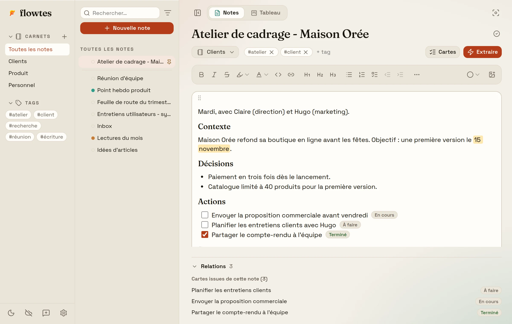
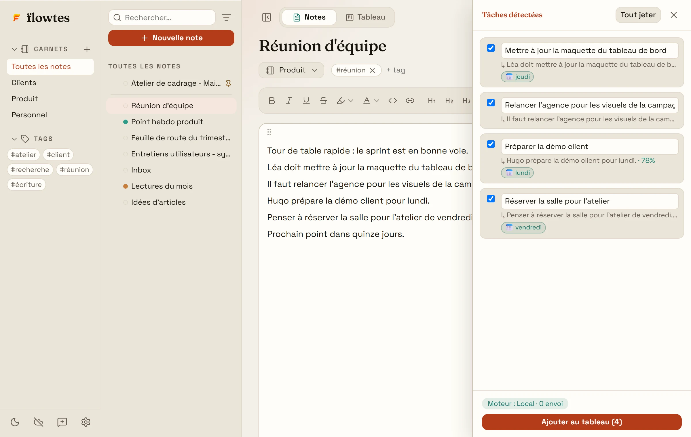
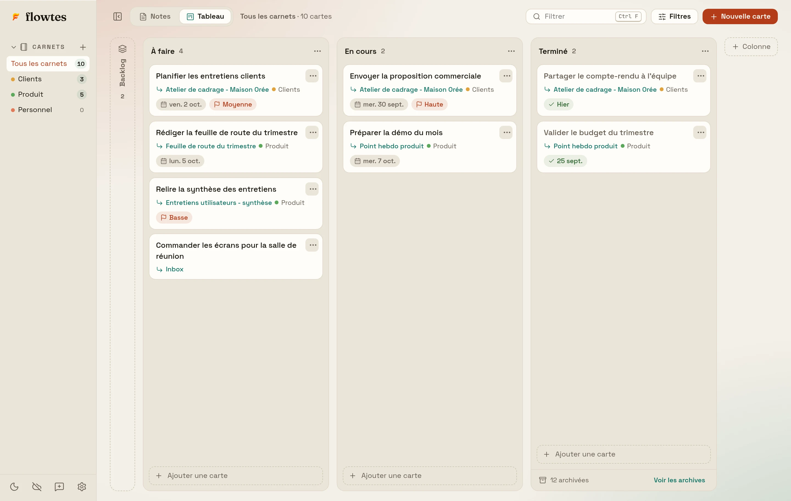

# Flowtes

**Vos notes de réunion deviennent votre plan d'action.**

Une app de bureau qui réunit vos notes et votre tableau de tâches. 
Elle repère les actions dans ce que vous écrivez. Vos données restent sur votre ordinateur.

  <a href="https://github.com/Vitopya/flowtes-releases/releases/download/v0.8.0/Flowtes_0.8.0_x64-setup.exe"><b>Télécharger pour Windows</b></a>
  &nbsp;·&nbsp;
  <a href="https://github.com/Vitopya/flowtes-releases/releases/download/v0.8.0/Flowtes_0.8.0_aarch64.dmg"><b>Mac à puce Apple</b></a>
  &nbsp;·&nbsp;
  <a href="https://github.com/Vitopya/flowtes-releases/releases/download/v0.8.0/Flowtes_0.8.0_x64.dmg"><b>Mac Intel</b></a>

Version 0.8.0 du 28 septembre 2026 · Gratuit · Sans compte · Fonctionne hors ligne

 

<picture>
  <source media="(prefers-color-scheme: dark)" srcset="assets/note-sombre.webp">
  
</picture>

## De la note au tableau, sans rien recopier

Après une réunion, on relit ses notes, on repère les actions, puis on les recopie dans un autre outil. Flowtes fait ce trajet avec vous, sans quitter la note.

**1. Écrivez comme d'habitude.** Titres, listes, cases à cocher, tableaux, images, sections repliables, et liens entre vos notes avec `[[ ]]`. Rangez-les en carnets, sous-notes et tags ; retrouvez-les avec la recherche ou la palette de commandes (Ctrl+P, ⌘+P sur Mac).

**2. Extrayez les actions.** Le bouton Extraire repère les tâches d'une note et leurs échéances, comme « d'ici jeudi » ou « lundi ». Vous gardez, corrigez ou écartez chaque proposition : rien n'arrive au tableau sans votre accord.

<picture>
  <source media="(prefers-color-scheme: dark)" srcset="assets/extraction-sombre.webp">
  
</picture>

**3. Suivez-les au tableau.** Chaque carte garde le lien vers la note dont elle vient. Cochez la case dans la note : la carte passe en Terminé. Déplacez la carte : la note l'affiche. Échéances, priorités, filtre par carnet et backlog sont là quand vous en avez besoin, et les cartes terminées depuis sept jours s'archivent seules.

<picture>
  <source media="(prefers-color-scheme: dark)" srcset="assets/tableau-sombre.webp">
  
</picture>

**Au quotidien.** Ctrl+Maj+Espace (⌘+Maj+Espace sur Mac) ouvre une petite fenêtre de capture depuis n'importe quelle application : le texte rejoint votre note Inbox. Le mode concentration laisse toute la place à la note, le zoom du texte va de 50 à 200 %, et sept thèmes de couleur existent en clair comme en sombre.

## Vos notes restent chez vous

- **Hors ligne d'abord.** Flowtes fonctionne sans connexion. Vos notes sont enregistrées sur votre ordinateur, dans une base chiffrée dont la clé est gardée par le trousseau du système.
- **Aucune télémétrie.** Pas de compte obligatoire, pas de publicité, aucune mesure de votre usage.
- **L'extraction se fait sur votre machine.** Le moteur par défaut ne se connecte à rien et apprend de vos choix. Si vous préférez un modèle d'IA, branchez Ollama sur votre ordinateur, ou votre propre clé Gemini, Claude ou compatible OpenAI. Flowtes demande votre accord avant le premier envoi, et un badge indique toujours quel moteur agit et ce qui sort de l'ordinateur.
- **Synchronisation facultative.** Pour retrouver vos notes sur plusieurs ordinateurs, reliez votre propre projet Supabase, dont l'offre gratuite suffit. Réglages > Synchronisation vous guide en cinq étapes vérifiées.
- **Sans enfermement.** Réglages > Données exporte toutes vos notes en Markdown, lisibles partout, et importe un dossier de fichiers .md (Obsidian, par exemple).

## Installer Flowtes

| Votre ordinateur | Fichier à télécharger |
|---|---|
| Windows 10 ou 11 (64 bits) | [Flowtes_0.8.0_x64-setup.exe](https://github.com/Vitopya/flowtes-releases/releases/download/v0.8.0/Flowtes_0.8.0_x64-setup.exe) |
| Mac à puce Apple (M1 et suivants) | [Flowtes_0.8.0_aarch64.dmg](https://github.com/Vitopya/flowtes-releases/releases/download/v0.8.0/Flowtes_0.8.0_aarch64.dmg) |
| Mac Intel | [Flowtes_0.8.0_x64.dmg](https://github.com/Vitopya/flowtes-releases/releases/download/v0.8.0/Flowtes_0.8.0_x64.dmg) |

Puce Apple ou Intel ? Menu Pomme > À propos de ce Mac : la ligne « Puce » désigne un Mac à puce Apple, la ligne « Processeur » un Mac Intel.

**Sur Windows**, lancez l'installeur. Flowtes n'étant pas signé par un certificat commercial, SmartScreen peut afficher « Windows a protégé votre ordinateur » : cliquez sur « Informations complémentaires », puis sur « Exécuter quand même ».

**Sur Mac**, ouvrez le fichier .dmg et glissez Flowtes dans Applications. L'app n'étant pas notarisée par Apple, macOS bloque son premier lancement, une seule fois par installation :

- jusqu'à macOS 14 : clic droit sur Flowtes, « Ouvrir », puis « Ouvrir » à nouveau ;
- à partir de macOS 15 : lancez l'app une fois, ouvrez Réglages Système > Confidentialité et sécurité, cliquez sur « Ouvrir quand même » et confirmez avec votre mot de passe.

**Mises à jour.** Flowtes vérifie au lancement si une nouvelle version existe et vous la propose. Chaque mise à jour est signée : l'app contrôle cette signature avant d'installer quoi que ce soit, et vos notes sont conservées.

Toutes les versions et leurs notes : [page des versions](https://github.com/Vitopya/flowtes-releases/releases).

## Nouveautés de la version 0.8.0

Choisissez la taille de votre texte, et reproduisez une mise en forme d'un coup de pinceau.

- La taille du texte, de 8 à 72
- Reproduire la mise en forme

[Le détail de la version 0.8.0](https://github.com/Vitopya/flowtes-releases/releases/tag/v0.8.0)

## Questions fréquentes

<b>Flowtes est-il gratuit ?</b>

 
Oui. Flowtes est gratuit et ne contient aucune publicité. La synchronisation, facultative, passe par votre propre projet Supabase, dont l'offre gratuite suffit.

<b>Faut-il créer un compte ?</b>

 
Non. Un compte ne sert qu'à la synchronisation entre vos appareils, si vous choisissez de l'activer.

<b>Où sont enregistrées mes notes ?</b>

 
Sur votre ordinateur, dans une base chiffrée. Pour garder une copie lisible, Réglages > Données > Exporter mes notes crée un fichier Markdown par note dans Documents/Flowtes-export.

<b>Mes notes passent-elles par Internet ?</b>

 
Non, tant que vous n'activez ni la synchronisation, ni un moteur d'IA en ligne. Dans ces deux cas, rien ne part sans votre accord, et l'app indique ce qui est envoyé.

<b>Mon Mac demande mon mot de passe à l'ouverture de Flowtes</b>

 
La clé qui chiffre vos notes est gardée par le trousseau de macOS. Après une installation ou une mise à jour, le trousseau demande l'autorisation de la lire : saisissez votre mot de passe, puis choisissez « Toujours autoriser ». Refuser empêche Flowtes d'ouvrir vos données.

<b>Comment signaler un problème ou proposer une idée ?</b>

 
Dans Flowtes, le bouton « Envoyer un retour », en bas de la barre latérale, prépare un message dans votre messagerie. Vous voyez exactement ce qui part avant de l'envoyer.

<b>Comment désinstaller Flowtes ?</b>

 
Sur Windows : Paramètres > Applications > Flowtes > Désinstaller. Sur Mac : glissez Flowtes depuis Applications vers la Corbeille. Pour effacer aussi vos notes, commencez par Réglages > Données > Supprimer les données locales.

## Licence

Flowtes est un logiciel propriétaire et gratuit. © 2026 Joseph Deffayet, tous droits réservés.

Vous pouvez installer et utiliser Flowtes librement, pour un usage personnel ou professionnel. Son code, son interface et sa marque ne sont pas libres : les copier, les redistribuer, les modifier ou les décompiler n'est pas autorisé. Ce dépôt ne contient que les versions publiées de l'application, pas son code source. Conditions complètes : [LICENSE.md](LICENSE.md).
